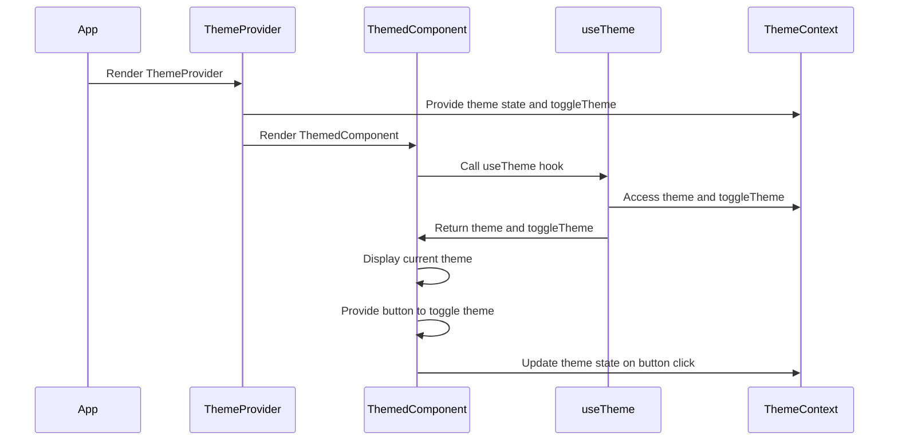

# Context+TS

## Take the ThemeContext as an example




1. ### Create ThemeContext

   1. Call the `createContext` method。
   2. Specify a generic union type, `ThemeContextProps | undefined`, representing the state to be maintained and the methods to operate on the state.
   3. Export and return the `ThemeContext`.

   ```js
   import { createContext } from 'react';
   
   interface ThemeContextProps {
     theme: string;
     toggleTheme: () => void;
   }
   
   const ThemeContext = createContext<ThemeContextProps | undefined>(undefined);
   
   export default ThemeContext;
   
   ```

2. ### Create ThemeProvider functional component

   1. The type of `ThemeProvider` is `React.FC<{children: ReactNode}>`, indicating that its function parameter is `{children: ReactNode}`.
   2. Implement methods for managing the specific state and its operations.
   3. Return JSX with `ThemeContext.Provider` as the root node . Pass state and its operations into `value` property (as an object). Place `{children}` inside the node.

   ```tsx
   const ThemeProvider: FC<{ children: ReactNode }> = ({ children }) => {
     const [theme, setTheme] = useState('light');
   
     const toggleTheme = () => {
       setTheme((prevTheme) => (prevTheme === 'light' ? 'dark' : 'light'));
     };
   
     return (
       <ThemeContext.Provider value={{ theme, toggleTheme }}>
         {children}
       </ThemeContext.Provider>
     );
   };
   ```

3. ### Create a custom hook called useTheme

   1. The return type of `useTheme` is `ThemeContextProps`.

   2. Use `useContext(ThemeContext)` to return the context.

   3. If `!context` is true, throw an error with the message "useTheme must be used within a ThemeProvider."

```js
const useTheme = (): ThemeContextProps => {
  const context = useContext(ThemeContext);
  if (!context) {
    throw new Error('useTheme must be used within a ThemeProvider');
  }
  return context;
};
```


### 4. Use `ThemeProvider` as the common parent of components that need to share state

```tsx
const App: React.FC = () => {
  return (
    <ThemeProvider>
      <ThemedComponent />
    </ThemeProvider>
  );
};
```


### 5. Use the `useTheme` hook in places where state is needed, and destructure the returned object into the corresponding state and state methods

```tsx
const ThemedComponent: React.FC = () => {
  const { theme, toggleTheme } = useTheme();

  return (
    <div>
      <p>Current theme: {theme}</p>
      <button onClick={toggleTheme}>Toggle Theme</button>
    </div>
  );
};
```


### Additionally：How to define a React component that can accept child components.

1. ReactNode represents child nodes of React elements (all possible types).
2. Define an anonymous Props interface as the first generic type of React.FC, which includes children: ReactNode.
3. The function parameters accept the destructured object of the interface.
4. Insert the child component into the JSX template.

```tsx
const Parent: React.FC<{ children: ReactNode }> = ({ children }) {
    return (
    	<div>{children}</div>
    )
}
```


## Full Code

```tsx
// ThemeContext.tsx
import React, { createContext, useState, useContext, ReactNode, FC } from 'react';

// Define the ThemeContextProps interface
interface ThemeContextProps {
  theme: string;
  toggleTheme: () => void;
}

// Create the ThemeContext
const ThemeContext = createContext<ThemeContextProps | undefined>(undefined);

// Define the ThemeProvider component
const ThemeProvider: FC<{ children: ReactNode }> = ({ children }) => {
  // State and state management functions
  const [theme, setTheme] = useState('light');

  const toggleTheme = () => {
    setTheme((prevTheme) => (prevTheme === 'light' ? 'dark' : 'light'));
  };

  return (
    <ThemeContext.Provider value={{ theme, toggleTheme }}>
      {children}
    </ThemeContext.Provider>
  );
};

// Define the useTheme hook
const useTheme = (): ThemeContextProps => {
  const context = useContext(ThemeContext);
  if (!context) {
    throw new Error('useTheme must be used within a ThemeProvider');
  }
  return context;
};

export { ThemeProvider, useTheme };

// ThemedComponent.tsx
import React from 'react';
import { useTheme } from './ThemeContext';

const ThemedComponent: React.FC = () => {
  // Use the useTheme hook and destructure the returned object
  const { theme, toggleTheme } = useTheme();

  return (
    <div>
      <p>Current theme: {theme}</p>
      <button onClick={toggleTheme}>Toggle Theme</button>
    </div>
  );
};

export default ThemedComponent;

// App.tsx
import React from 'react';
import { ThemeProvider } from './ThemeContext';
import ThemedComponent from './ThemedComponent';

// Create the App component, using ThemeProvider as the common parent component
const App: React.FC = () => {
  return (
    <ThemeProvider>
      <ThemedComponent />
      {/* More components that need to share theme state can be added here */}
    </ThemeProvider>
  );
};

export default App;
```
